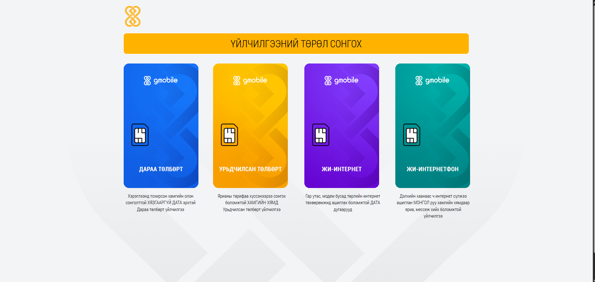
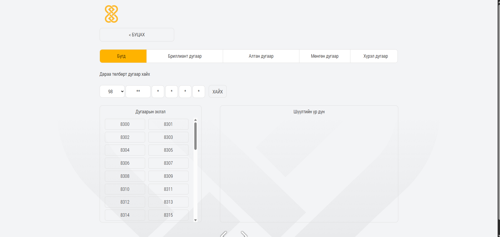

# 📱 nFilterNew

A Django-based web application to filter and manage phone numbers. Designed to simplify the process of selecting or filtering phone numbers for customers.

---

## 🚀 Features
- Filter phone numbers based on custom logic
- Simple, clean frontend interface
- Built with Django and Bootstrap

---

## ⚙️ Installation

```bash
# Clone the repo
git clone https://github.com/batbyr-hub/nFilterNew.git

# Create a virtual environment
python -m venv env
source env/bin/activate  # On Windows: env\Scripts\activate

# Install dependencies
pip install -r requirements.txt

# Run migrations
python manage.py migrate

# Start the server
python manage.py runserver

## 💡 Usage

Once the server is running, open your browser and go to:
http://localhost:8000

You’ll see the phone number filter tool.





### Features:
- 🔍 Enter filter conditions in the form (e.g., prefix, length, etc.)
- 🧹 View results based on your criteria
- 💾 Download or copy filtered numbers (if this feature exists)

This tool is useful for telecom businesses or users who need to search and organize phone numbers by specific rules.

🛡️ License
This project is open-source under the MIT License.

👤 Author
Batbayar Altanbagana
Django Developer | Python & PostgreSQL
